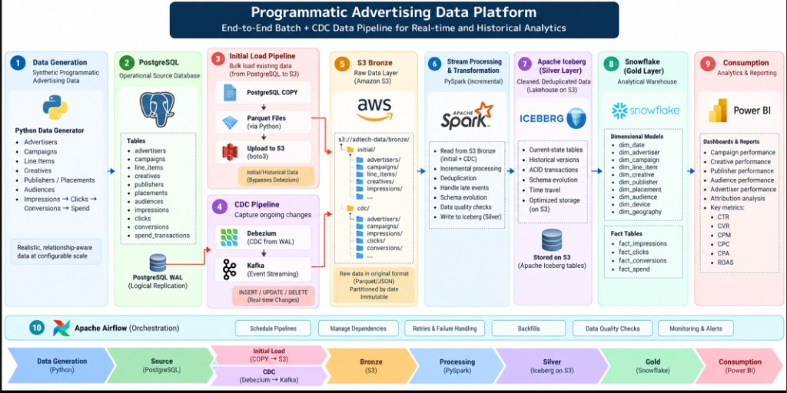

# Architecture



## Target architecture

```
PostgreSQL          operational source of truth (OLTP)
    │  WAL / logical decoding
    ▼
Debezium            change data capture
    │
    ▼
Apache Kafka        durable, partitioned change and event log
    │
    ▼
Amazon S3 (Bronze)  immutable raw CDC envelopes, partitioned by date
    │
    ▼
PySpark             incremental, idempotent processing
    │
    ▼
Apache Iceberg      Silver: ACID tables, schema evolution, time travel
    │
    ▼
Snowflake           RAW → STAGING → CORE → ANALYTICS
    │
    ▼
Dimensional model   SCD1/SCD2 dimensions, four fact tables
    │
    ▼
Gold data products  campaign, creative, publisher, audience, attribution
    │
    ▼
Power BI / SQL
```

Apache Airflow orchestrates the stages. Phase 1 builds the leftmost box and the
data that flows through everything to its right.

## What exists today (Phase 1)

```
config/*.yml ──┐
               ├─> data_generator ──> validation ──> PostgreSQL ──> data_quality
reference/*.yml┘      (in memory)     (in process)    (COPY)         (SQL)
```

| Component | Responsibility |
|---|---|
| `config/scales.yml` | dataset volumes for the tiny/small/medium/large profiles |
| `config/generation.yml` | ecosystem behaviour: timeline, funnel, pricing, spend, validation |
| `data_generator/reference/*.yml` | business vocabulary and all conditional weight tables |
| `data_generator/relationships.py` | the ecosystem graph; refuses to register orphans |
| `data_generator/*.py` (per entity) | one module per table, as in the project brief |
| `data_generator/events.py` | streams the funnel campaign by campaign |
| `data_generator/validation.py` | in-process referential, temporal and business rule checks |
| `data_generator/sinks.py` | batched, dependency-ordered writes to PostgreSQL or CSV |
| `data_quality/` | SQL-level checks and join validation |
| `postgres/` | schema, reference seed, post-load indexes |

## Design decisions that outlive Phase 1

**Streaming, not materialising.** Events are generated one campaign-day at a
time and flushed in batches, so peak memory is proportional to a single
campaign's traffic rather than the dataset. The same structure is what makes the
100M-row LARGE profile feasible without a rewrite.

**Dependency-ordered flushing.** `models.TABLE_ORDER` is the single definition of
foreign-key order. The emitter flushes in that order, the loader truncates and
validates in that order, and the database's foreign keys stay immediately
enforced throughout.

**Configuration as data.** Row counts, weight tables, compatibility matrices and
behavioural knobs are YAML. Changing the shape of the ecosystem never requires a
code change, which is what makes the tiny/small/medium/large ladder meaningful.

**Derived seeds per stream.** Every random stream is seeded from
`blake2b(master_seed || stream path)`, so adding a stream never shifts existing
output and any campaign-day can be regenerated in isolation.

**Backfill and CDC tail are separate jobs.** The existing rows leave through a
bulk export; only subsequent changes flow through Debezium. Debezium is
configured with `snapshot.mode: no_data` so it never re-reads the 100 million
rows already loaded, and the export refuses to run until the replication slot
exists, so the handover cannot leave a gap. See [cdc.md](cdc.md).

**Bronze is append-only, and stores payloads opaquely.** Both paths land in
object storage as Parquet and nothing there is ever updated: a correction is a
later change event with a higher LSN, and Silver decides which wins. Change
payloads are kept as JSON strings rather than structs, so a source schema change
cannot split the history into mutually unreadable halves. See
[bronze.md](bronze.md).

## Phases

| # | Phase | Status |
|---|---|---|
| 1 | PostgreSQL + realistic synthetic data generator | **complete** |
| 2 | CDC + Debezium | **complete** |
| 3 | Kafka (partitioning, retention, throughput) | **complete** |
| 4 | S3 Bronze | **complete** |
| 5 | Spark ingestion | **complete** |
| 6 | Iceberg Silver | **complete** |
| 7 | Incremental processing | not started |
| 8 | Data quality | partially (source-layer checks exist) |
| 9 | SCD Type 1 | not started |
| 10 | SCD Type 2 | not started |
| 11 | Snowflake | not started |
| 12 | Dimensional modelling | not started |
| 13 | Gold data products | not started |
| 14 | Attribution | not started (last-click chain exists in the data) |
| 15 | Airflow orchestration | not started |
| 16 | Late-arriving events | not started |
| 17 | Schema evolution | not started |
| 18 | Failure recovery | not started |
| 19 | Monitoring, documentation, dashboard | not started |
